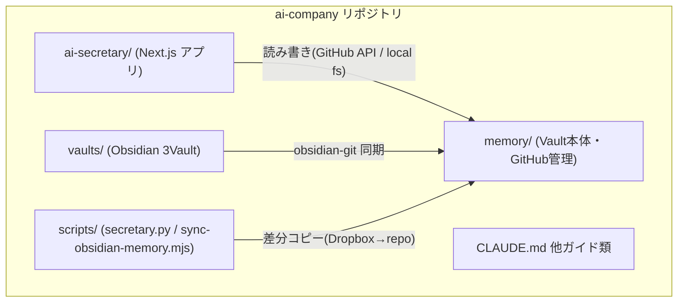
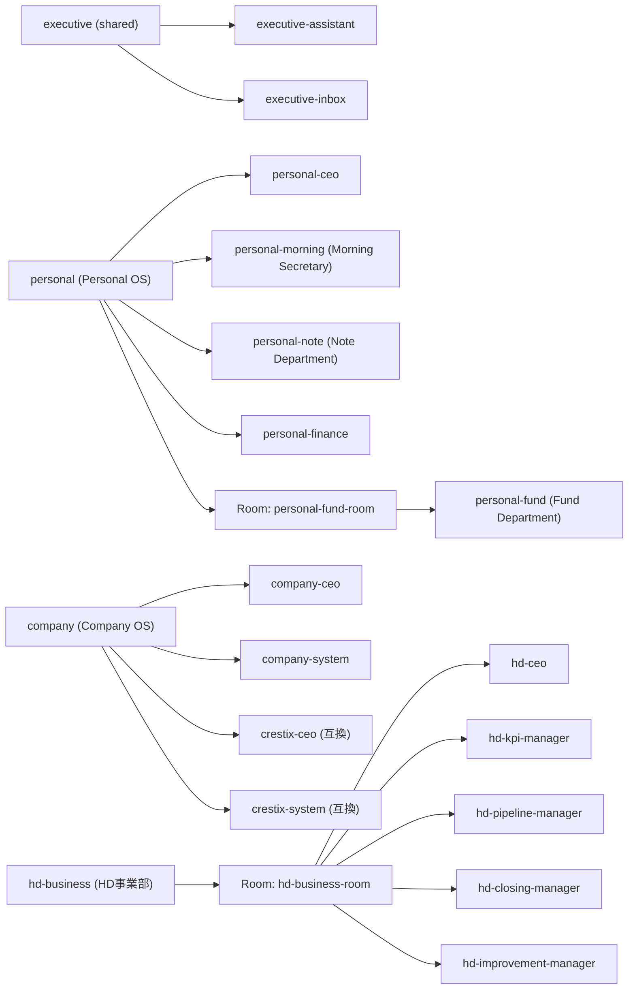
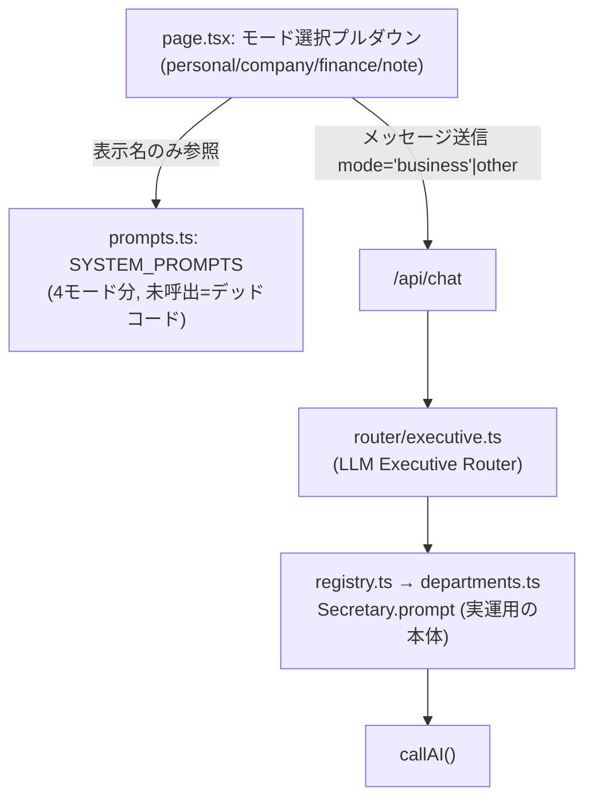
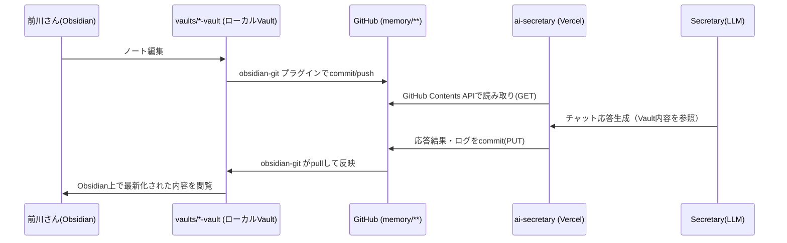
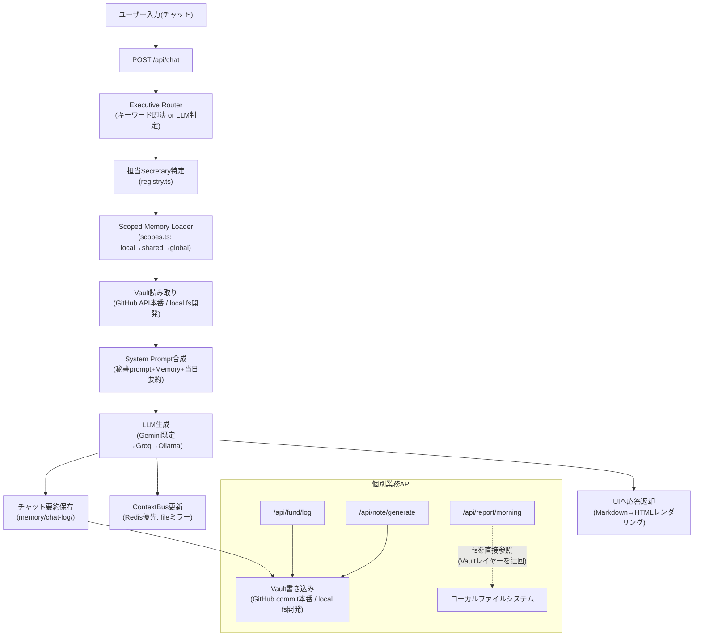

# AI Company 現状分析（01_CURRENT_SYSTEM_ANALYSIS）

> 目的: リファクタリングではなく「現在の設計を理解し、拡張の土台を作る」ための分析。
> 本ドキュメントはコードを書かず、ディレクトリ変更・リファクタリング・新Vault・新Memoryシステムの提案は行わない。
> Obsidian Vault（GitHub上の `memory/**/*.md`）を Single Source of Truth として扱う。
> 調査時点: 2026-07-09 / 最新コミット `05580c8`

---

## 1. Project Structure（現在のディレクトリ構成）

```
ai-company/
├── ai-secretary/            … Next.js 14 アプリ本体（Vercelデプロイ）
│   ├── app/api/              … 9本のAPIエンドポイント
│   ├── app/lib/               … config / router / memory / ai / context / report 等
│   ├── app/page.tsx           … チャットUI
│   └── components/            … Breadcrumbs, ExecutivePanel, FlowMap, OrgTree, SecretaryHeader
├── memory/                  … Vault本体（Obsidianと同期するMarkdown群）
│   ├── company/ crestix/ personal/ note/ shared/ chat-log/ archive/ flow-map/
├── vaults/                  … Obsidian Vault（3種：personal / holding / crestix）
├── vault/AI会社/             … 用途要確認の単一フォルダ
├── prompts/secretaries/     … CLI版（secretary.py）用プロンプト
├── secretaries/             … personal-secretary.md
├── scripts/                 … secretary.py（Ollama CLI）, sync-obsidian-memory.mjs
└── CLAUDE.md / AGENTS.md / CRITICAL_FIXES.md / NOTE_COMPANY_REQUIREMENTS.md / START-HERE.md
```



---

## 2. Departments（事業部門）

定義源は `ai-secretary/app/lib/config/departments.ts` の一箇所のみ（`DEPARTMENTS`配列）。



- **Morning Secretary**（`personal-morning`）: 独立したDepartmentではなく、`personal` Department内の1秘書。朝会レポート（`/morning-report`）でInbox・タスク・投資ポジション・note下書き・HD Business KPIを横断集約する。
- **Fund Department**（`personal-fund-room`）: `personal` Department内のRoom。秘書は`personal-fund`1体のみ。データは`memory/personal/fund/`配下に9ファイル（fund/rules/watchlist/portfolio/positions/themes/earnings + investment-log/）が実在し、稼働データは充実している。
- **Note Department**: 独立Departmentではなく`personal`直下の秘書1体（`personal-note`）。データは`memory/personal/note/`にあるが、後述（6節）の通り一部ファイル欠落あり。
- **その他Department**:
  - `company`（Company OS）: Crestix経営全般。`crestix-*`は旧名称からの後方互換用エイリアスで、`company-*`と実質同じスコープ。
  - `hd-business`（HD Business）: Company傘下、営業KPI特化。5秘書体制で最も細分化されている。参照ファイルは`memory/company/hd-business/`に10本すべて実在確認済み。
  - `executive`: 部門を横断する雑談窓口とInbox収集専用。

---

## 3. Secretaries（秘書一覧・責務・利用Prompt・利用API）

| Secretary | 責務 | 利用Prompt | 主に呼ばれるAPI |
|---|---|---|---|
| `executive-assistant` | 全般相談・専門秘書への橋渡し | `departments.ts`内個別prompt（短文） | `/api/chat` |
| `executive-inbox` | 雑多な入力のInbox収集 | 同上 | `/api/chat`（→ContextBus Inbox） |
| `personal-ceo` | 個人事業全体のリソース配分・意思決定 | 個別prompt（フォーマット指定あり：今週最重要/今やるべき事業/止めるべきこと等） | `/api/chat` |
| `personal-morning` | 日次オペレーション統括・朝会レポート | 個別prompt＋`report/morning.ts`内の専用system prompt | `/api/chat`, `/api/report/morning` |
| `personal-note` | note企画〜下書き〜投稿計画〜KPI | 個別prompt（5大テーマ・収益モデル・フックテンプレ等、最も作り込まれている） | `/api/chat`, `/api/note/generate`, `/api/note/promote` |
| `personal-finance` | 資産形成・個別株分析（NISA等） | 個別prompt | `/api/chat` |
| `personal-fund` | 投資判断OS（売買シグナル・リスク管理） | 個別prompt（Decision Score等フォーマット厳格） | `/api/chat`, `/api/fund/log`, `/api/fund/report` |
| `company-ceo` / `crestix-ceo` | Crestix中長期戦略 | 個別prompt（内容は2秘書とも同一） | `/api/chat` |
| `company-system` / `crestix-system` | AI Company OS自体の開発サポート | 個別prompt（内容は2秘書とも同一） | `/api/chat` |
| `hd-ceo` | HD事業部統括・今月着地予測 | 個別prompt | `/api/chat` |
| `hd-kpi-manager` | KPI逆算（架電数まで） | 個別prompt | `/api/chat` |
| `hd-pipeline-manager` | 案件進捗・確度管理 | 個別prompt | `/api/chat` |
| `hd-closing-manager` | 高確度案件クロージング | 個別prompt | `/api/chat` |
| `hd-improvement-manager` | ボトルネック特定・改善提案 | 個別prompt | `/api/chat` |

全秘書共通で、担当が決まった後は`loadScopedMemory()`が`scopes.ts`のスコープ定義に従い該当Markdownを読み込み、秘書prompt＋Memory＋当日チャット要約を1つのsystem promptに合成してLLMへ渡す（詳細は9節Data Flow）。

---

## 4. Skills（Claude Code Skills）

現状、本プロジェクトには **Claude Code Skillsの実装が存在しない**。`.claude/`配下は`settings.local.json`（permission設定のみ）だけで、`.claude/skills/`・`.claude/commands/`はいずれも未作成。

- **役割**: 現状ゼロ。「秘書のprompt＋スコープされたMemory」だけで全機能を実現しており、Skillという独立した再利用可能ユニットの概念自体が存在しない。
- **依存関係**: なし（存在しないため）。
- **改善余地**: CLAUDE.md/AGENTS.mdに記載の「スラッシュコマンド」（`/note-draft`等）はClaude Code側のSkillやCommandではなく、**チャット本文としてユーザーが入力する文字列**を`router/executive.ts`がキーワード判定しているだけ。将来Claude Code Skillsを導入する場合、これらのスラッシュコマンド相当の処理（noteの下書き生成、投資ログの整形保存、KPI逆算計算など、現状LLMのプロンプト内で"祈るように"再現している定型処理）をSkillとして切り出せる余地が大きい。

---

## 5. Prompt（プロンプト体系）

**2つの独立したプロンプト体系が並存している。**



| 体系 | 場所 | 件数 | 責務 | 再利用性 | 呼び出し状況 |
|---|---|---|---|---|---|
| 秘書別prompt（本流） | `departments.ts` の `Secretary.prompt` | 16件 | 各秘書の人格・出力フォーマット・行動指針を個別定義 | 低（秘書ごとにベタ書き、共通部分の重複あり） | `chat/route.ts`が実際に使用 |
| モード別prompt（旧世代） | `prompts.ts` の `SYSTEM_PROMPTS` | 4件（personal/company/finance/note） | モード単位の人格定義（note用は特に詳細） | 中（4モードに集約されている分、秘書別より構造化） | **どこからも呼ばれていない**（`getSystemPrompt`呼び出し元なし） |
| 朝会専用prompt | `report/morning.ts` 内インライン | 1件 | 朝会レポートの出力フォーマット指定 | 低（関数内ハードコード） | `/api/report/morning`が使用 |
| ルーティング用meta-prompt | `router/executive.ts` / `router/inbox.ts` 内 | 2件 | 秘書レジストリ全体をJSON化してLLMに渡し、ルーティング先を判定させる | 中 | `/api/chat`（自動ルーティング時）が使用 |

**改善点**: 秘書別promptは「担当領域」「行動指針」「出力フォーマット」「利用可能コマンド」という共通の型を持つ秘書が多く、テンプレート化（共通部分をベース関数化し秘書固有部分だけ差し込む）の余地がある。`prompts.ts`は死んでいるコードか、モード概念を今後正式に使うかの判断が必要。

---

## 6. Memory（memory/ の構造・保存方法・更新方法）

### 構造
```
memory/
├── company/        … profile.md, strategy.md, strategy/index.md, hd-business/*(10ファイル・全実在)
├── crestix/         … profile.md, strategy.md（company/と内容重複、スコープからは孤立気味）
├── personal/        … profile.md, goals.md, rules.md, content_strategy.md, interests.md
│                       fund/(9ファイル全実在), finance/(budget-rules.mdのみ), note/, tasks/, logs/, thinking/, capture/, investment/
├── note/             … drafts/ideas/published/research/templates（personal/note/と重複、スコープから未参照）
├── shared/           … ai-development-rules.md
├── chat-log/         … 秘書ID別サブフォルダに日次要約
├── archive/          … today.md/tasks.md/strategy.md/portfolio.md の上書き前スナップショット
├── flow-map/         … 日付ベースのメモ
├── goals.md / today.md / current-bus.json … ルート直下の共通ファイル
```

### 保存方法
- ローカル開発: `fs`でファイルシステムに直接読み書き（`VAULT_ROOT`環境変数、既定はDropbox上のObsidianパス）。
- 本番（Vercel）: GitHub Contents API経由（`vault.ts`がbase64エンコード/デコードしてコミット）。
- `saveWithArchiving()`（`memory/saver.ts`）が、`today.md`/`tasks.md`/`strategy.md`/`portfolio.md`の上書き前に自動で`memory/archive/{mode}/{filename}-YYYY-MM-DD.md`へバックアップを取る仕組みを持つ。

### 更新方法
1. **チャット経由**: 秘書との会話後、`saveChatLog()`が当日の要約を`memory/chat-log/{secretaryId}/{date}-summary.md`へ保存。次回同じ秘書と話す際にこの要約が自動でsystem promptに注入される（短期記憶の役割）。
2. **API経由**: `/api/vault/[...path]`（汎用）、`/api/fund/log`（投資ログ）、`/api/note/generate`・`/api/note/promote`（note下書き）、`/api/knowledge/save`（ナレッジ）がそれぞれ専用フォーマットでファイルを新規作成・追記する。
3. **人間が直接編集**: Obsidian（`vaults/`）経由、または前川さんのDropboxローカルVault経由（`scripts/sync-obsidian-memory.mjs`で`memory/personal`・`memory/shared`のみrepoへ差分コピー、`--overwrite`フラグなしなら既存ファイルは上書きしない）。

**注記（変更提案ではなく事実確認）**: `memory/note/`と`memory/company/` `memory/crestix/`には、現在の秘書スコープ定義（`scopes.ts`）から参照されていないファイル群が存在する。削除や統合は提案しないが、「今どのファイルが実際に読まれているか」を把握しておくことはExtension Points検討の前提になる。

---

## 7. Vault（Obsidian）

### 利用用途
`vaults/`配下の3つのVault（`personal-vault` / `holding-vault` / `crestix-vault`）は、前川さんが**人間として閲覧・編集する入口**。各Vaultに`00_Dashboard.md.md`をはじめとするダッシュボード・knowledge・kpi・tasks等のノートが用意されている。

### 更新フロー


### 同期方法
- **Obsidian ⇔ GitHub**: `.obsidian/plugins/obsidian-git`・`git-obsi-sync`プラグインが担当（vaults/配下）。
- **Dropbox ⇔ repo**: `scripts/sync-obsidian-memory.mjs`が、前川さんの個人PC上のDropbox Vault（`VAULT_ROOT`既定値）から`memory/personal`・`memory/shared`だけを手動実行で差分コピー。自動化はされていない（手動スクリプト実行が前提）。
- **App ⇔ GitHub**: `vault.ts`（fetch直叩き、Vercel本番の主経路）と`github.ts`（Octokit、`role.md`/`tasks.md`専用）の2経路が存在。

---

## 8. API（一覧・責務・利用箇所）

| Endpoint | 責務 | 主な利用箇所 |
|---|---|---|
| `POST /api/chat` | 秘書ルーティング＋応答生成のメインエンドポイント | `page.tsx`（チャットUI本体） |
| `GET/PUT /api/vault/[...path]` | Vault内任意ファイルの汎用読み書き | 内部的に他APIから間接利用、および直接呼び出しも可能な汎用口 |
| `GET/PUT /api/memory/[filename]` | role/tasks/profile/goals/today専用の読み書き | Company関連のUI（役割・タスク編集画面があれば） |
| `POST/GET /api/fund/log` | 投資判断ログの記録・取得 | `personal-fund`秘書とのチャット（買い/売り判断時にログ生成） |
| `GET /api/fund/report` | ポジション/ポートフォリオをJSON化 | `app/report/page.tsx`（投資レポート画面） |
| `POST /api/note/generate` | テーマ指定でnote下書き自動生成 | `personal-note`秘書ワークフロー |
| `POST /api/note/promote` | ナレッジ→リサーチ→下書きへの自動昇格 | ナレッジベースの活用フロー |
| `POST /api/knowledge/save` | 8カテゴリのナレッジ保存 | 汎用ナレッジ管理 |
| `GET /api/report/morning` | 朝会レポート生成 | `personal-morning`秘書、朝会UI |

全APIが`verifyApiSecret()`（`x-api-secret`ヘッダー検証）で保護されている。

---

## 9. Data Flow（ユーザー入力 → Secretary → Memory → Vault → API → UI）



`/api/report/morning`だけがVaultの読み取り抽象化（`vault.ts`）を経由せず`fs`を直接読んでいる点は、事実として記録しておく（改善提案は10節「Extension Points」ではなく別途Phase2で扱うべき事項のため、ここでは経路の違いとしてのみ図示）。

---

## 10. Extension Points（拡張しやすい場所）

Charter原則（Evolution over Revolution / Department First / Skills First / Prompt First）に沿い、**既存構造を壊さず追加できる**箇所を整理する。

### 追加できそうなDepartment
- 既存の`hd-business`（Room構造）と同型で、新しい事業部を`DEPARTMENTS`配列に1エントリ追加するだけで拡張可能。追加コストは「Department定義＋Secretary定義＋対応するMemoryディレクトリ＋スコープ定義」の4点のみで、既存部分への変更は不要。
- Note Departmentを将来Media Platform化する場合も、現状`personal`直下の単独秘書から「`personal-note-room`」のようなRoomへ格上げし、媒体別Secretary（Blog/YouTube/X/Threads/Podcast）をRoom内に追加していく形が、`personal-fund-room`・`hd-business-room`と同じパターンで最も既存構造と整合する。

### 追加できそうなSkills
- 現状Skillsが存在しないため、まずは「秘書のprompt内で自然文として指示している定型処理」をSkill化する余地が広い。候補: note下書きのフォーマット整形、投資ログのMarkdownテーブル生成（`/api/fund/log`が今はAPI内ロジックで直書きしている処理）、KPI逆算計算（`hd-kpi-manager`がprompt内で計算式を提示しているだけで実計算はLLM任せ）。
- スラッシュコマンド群（`/fund-review`等、CLAUDE.md記載）はSkill化の自然な単位。

### 追加できそうなPrompt
- 秘書別prompt（`departments.ts`）に「担当領域／行動指針／出力フォーマット／利用可能コマンド」という共通テンプレート構造が既に暗黙的に存在するため、新規秘書を追加する際もこの型を踏襲すれば一貫性を保てる。
- モード別prompt（`prompts.ts`）は現在未使用だが、もし「秘書より粗い粒度のペルソナ切替」を将来使うなら、ここに新モードを追加する形で拡張できる（要方針決定）。

---

*本ドキュメントは分析のみを目的とし、コード変更・ディレクトリ変更は一切行っていない。次のステップ（02_AI_COMPANY_V2_ARCHITECTURE.md）はこの分析を前提として設計する。*
