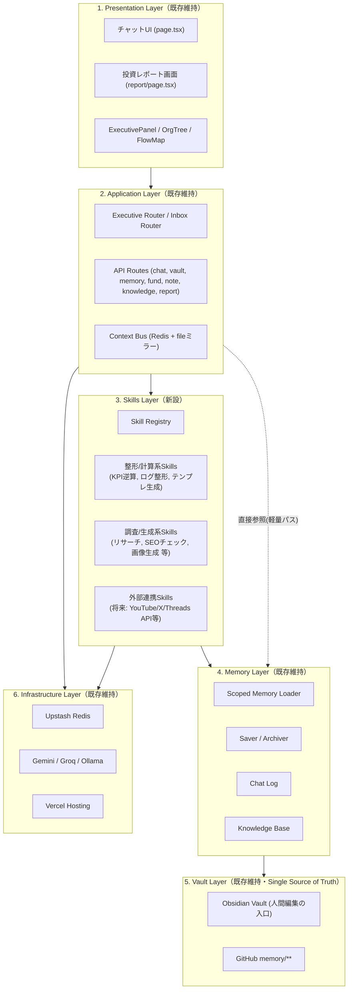
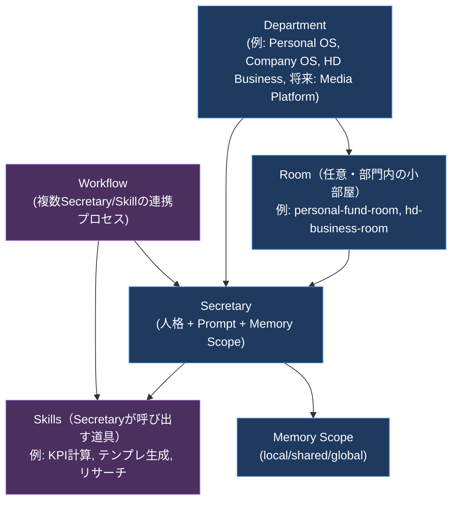
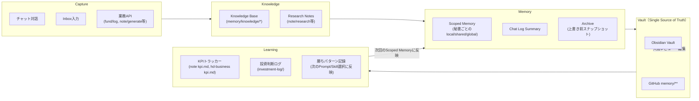
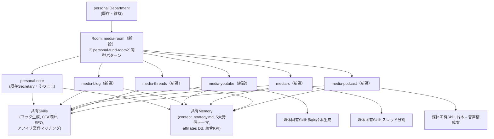
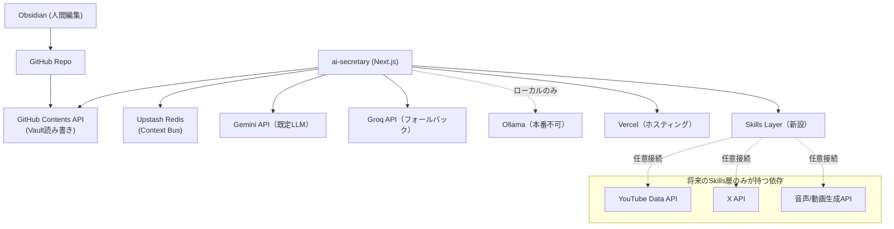

# AI Company v2 — アーキテクチャ設計（02_AI_COMPANY_V2_ARCHITECTURE）

> 前提: `01_CURRENT_SYSTEM_ANALYSIS.md`。既存構成（Obsidian / Memory / Department / API）を維持したまま、
> Skills・Promptの追加を優先する拡張アーキテクチャを設計する。コード不要、リファクタリング提案ではなく「今後5年運用できる型」の提示。

---

## 1. Overall Architecture（全体構成）

現行システムは実質「Presentation → Application → Memory → Vault」の4層で、Skills層が存在しない。v2では**既存4層はそのまま**に、**Application層とMemory層の間にSkills層を新設**する。これにより、秘書のprompt内に自然文でベタ書きされていた定型処理（フォーマット整形・KPI計算・テンプレート生成等）を、独立して呼び出し可能な単位として切り出せる。

**設計判断の要点**: Skills層は「Application層を置き換える」のではなく「Application層とMemory層の間に差し込む」形にする。単純な壁打ち・情報参照はこれまで通りApplication→Memoryの直接パスを許容し、定型処理・多段処理が必要な場合のみSecretaryがSkillを呼び出す、という**軽量パスと重量パスの両立**が既存API互換（Charter原則6）を守る鍵になる。

---

## 2. AI Agent（Secretary / Department / Agent / Workflow モデル）

現行の「Department → (Room →) Secretary」という3階層モデルはそのまま踏襲する。v2ではここに**Skills（Secretaryが呼び出す道具）**と**Workflow（複数SecretaryやSkillsを順序立てて連携させる業務プロセス）**を明示的な概念として追加する。

- **Department**: 既存4部門（executive / personal / company / hd-business）は維持。新設は「配列に1エントリ追加」で完結する既存パターンを継続。
- **Room**: 既に`personal-fund-room`・`hd-business-room`で実証済みのパターン。1部門内で複数専門秘書を束ねる単位として今後も積極利用する。
- **Secretary**: 人格＋Prompt＋Memory Scopeの三点セットという現行定義を維持。v2では四点目として**Skill Bindings（このSecretaryが呼べるSkillの一覧）**を追加する（既存のprompt/scope定義を壊さない追加フィールドとして）。
- **Skill（新）**: 単一責務の道具。LLMの自由記述に頼っていた定型処理（KPI逆算式の実計算、Markdownテーブル生成、投稿スケジュールのフォーマット等）をここに切り出す。Secretaryは「どのSkillを使うか」をprompt内で選択し、実行結果をMemoryに書き戻す。
- **Workflow（新）**: 現行でも`personal-note`秘書の`/note-research → /note-title → /note-outline → /note-draft → /note-post-plan → /note-kpi`という順序は事実上のWorkflowだが、これまでは「ユーザーが手動で1コマンドずつ打つ」ことで成立していた。v2ではこれを構造として名前を与え、将来的に「1つのWorkflowを起点に複数Secretary/Skillが連鎖する」拡張（例: 決算発表を検知→`personal-fund`が分析→`personal-note`が記事化）の土台とする。

---

## 3. Knowledge Flow（Knowledge / Memory / Vault / Learning）

**設計判断の要点**: KnowledgeとMemoryを分離しているのは、現行システムに既に「Knowledge（`/api/knowledge/save`）→Research→Draft」という昇格パイプライン（`/api/note/promote`）が実在するため。v2ではこの昇格パターンを**Note Department以外のDepartmentにも一般化できる型**として位置付ける（例: 営業ナレッジ→HD Business改善策への昇格、投資判断ログ→次の投資戦略への昇格）。LearningステージはVaultに書かれたKPI・ログを次回のScoped Memoryに再注入するループであり、これは現行でも`personal-morning`が`note/kpi.md`や`fund/positions.md`を横断参照する形で部分的に実現済み。v2ではこのループをDepartment横断で明示的に設計する。

---

## 4. Future Expansion（YouTube / X / Threads / Blog / Podcast への展開）

Charterのゴール「Note専用システムではなくAI Company全体の知識を活用するMedia Platform」を、**Department維持・Room追加**の原則内で設計する。Note Departmentという名前・現行秘書（`personal-note`）はそのまま残し、Room構造で媒体を横展開する。

**設計判断の要点**:
- **既存資産の再利用が前提**。`personal-note`秘書の5大発信テーマ・収益モデル・フックテンプレート（`departments.ts`内prompt）は媒体を横断する「発信の核」であり、書き直さず`SharedMem`として媒体別Secretaryから共通参照する。
- **媒体固有ロジックはSkillに閉じ込める**。動画台本化・スレッド分割・音声構成案化など媒体特有の変換処理はSecretaryのprompt本文を太らせるのではなくSkillとして独立させ、将来的な媒体追加（例: TikTok）はSkill1つの追加で対応できるようにする。
- **外部プラットフォームAPI（YouTube Data API、X API等）は「外部連携Skill」としてSkills層に隔離**し、Application層・Memory層・Vault層には触れさせない。これによりCharter原則6「API互換維持」を保ったまま新しい外部依存を追加できる。

---

## 5. Dependency（依存関係）

**設計判断の要点**: コアシステム（Presentation/Application/Memory/Vault）の外部依存は現行のまま5点（GitHub, Redis, Gemini, Groq, Vercel）に固定し増やさない。媒体展開に伴う新しい外部API依存はすべてSkills層の中に閉じ込め、コア層の依存グラフをシンプルに保つ。これにより、特定の媒体APIが将来変更・廃止されてもコアシステムへの影響を局所化できる。

---

## 6. Design Principles（設計原則）

Charterの絶対条件をアーキテクチャ上のルールとして具体化する。

| 原則 | 具体化ルール |
|---|---|
| Obsidian First | Vaultへの読み書きは既存の抽象化（`vault.ts`系）を必ず経由する。新しいDB・新しいVaultは作らない。 |
| Memory First | `memory/`のディレクトリ命名・階層（company/personal/note等）は維持。新しいSecretary/Departmentは既存階層の**配下に追加**する（並列の新体系を作らない）。 |
| Department First | Department/Room/Secretaryの3階層モデルを維持。新機能は既存Departmentの内部拡張（Room追加・Secretary追加）を第一選択とし、新Department新設は本当に既存のどれにも属さない場合のみ。 |
| Skills First | 新機能実装時、「秘書のprompt本文を太らせる」より先に「Skillとして切り出せないか」を検討する。特に、計算・整形・外部API呼び出しはSkillの担当。 |
| Prompt First | アプリケーションロジック（TypeScriptコード）を増やす前に、Prompt改善・Skill追加で解決できないかを検討する。 |
| API First | 既存9エンドポイントのリクエスト/レスポンス形式は変更しない。新機能は新規エンドポイント追加で対応する。 |
| Media Platform | Note Departmentは名称・既存Secretaryを維持したまま、Room構造で媒体を横展開する（4節参照）。 |
| Evolution over Revolution | 1回の変更は「1つのDepartment定義追加」「1つのSecretary追加」「1つのSkill追加」など、既存への影響範囲が閉じた単位に区切る。 |

---

## 7. Extension Strategy（今後追加する際のルール）

### 新しいDepartmentを追加する場合
1. `departments.ts`の`DEPARTMENTS`配列に新規エントリを追加（既存エントリは変更しない）。
2. 対応する`memory/{new-department}/`ディレクトリを既存命名規則に合わせて新設。
3. `scopes.ts`に新Secretaryのスコープを追加。
4. 既存Departmentのコード・データには一切触れない。

### 新しいSecretaryを追加する場合
1. 既存Department内、または新設Room内に追加（Charter原則3）。
2. Prompt構造は「担当領域／行動指針／出力フォーマット／利用可能コマンド」の既存テンプレート型を踏襲する。
3. Memory Scopeはlocal/shared/globalの3階層で定義し、globalは基本`memory/personal/profile.md`等の既存共通ファイルを指す。

### 新しいSkillを追加する場合（v2新設プロセス）
1. 「秘書のprompt内で自然文指示していた定型処理」または「外部API連携」のいずれかに該当するか確認する。
2. Skill Registryに単一責務の道具として登録する（1 Skill = 1責務）。
3. 対象Secretaryの「Skill Bindings」に追加する（Secretaryの人格Prompt本体は変更しない）。
4. 外部API依存を伴うSkillは、コア層（Memory/Vault/Application）に依存を漏らさない。

### 新しいPromptを追加・改善する場合
1. まず既存Secretaryのprompt改善で解決できないかを検討する（Prompt First）。
2. モード別prompt（`prompts.ts`）を正式に使うかどうかは、Phase2相当の意思決定として別途行う（本ドキュメントでは現状維持・凍結）。
3. 秘書間で重複する指示（例: 「感情排除・データで判断」等のトーン指定）は、共通ヘッダーとして切り出せないか検討する余地があるが、v2の必須要件ではない。

### 新しいAPIを追加する場合
1. 既存9エンドポイントとは独立したパスで新設する。
2. `verifyApiSecret()`による認証を必ず先頭に入れる（既存パターン踏襲）。
3. Vaultアクセスは`vault.ts`系の既存抽象化を使う（新しい読み書き経路を作らない）。

---

*本ドキュメントはアーキテクチャ設計のみを目的とし、コードは一切含まない。実装（Phase7）に進む場合は、本ドキュメントのDesign Principles・Extension Strategyに従うことを前提とする。*
