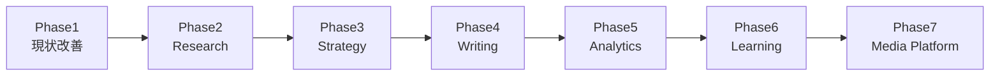

# AI Company v2 — 実装ロードマップ（05_IMPLEMENTATION_ROADMAP）

> 前提: `00`〜`04`の分析・設計・Phase2 Foundationを踏まえ、ここから実装に入る。
> 実装方針: **小さく作る／壊さない／毎回レビュー／毎回テスト**。
> コードは各Phase終了後・レビュー完了後にのみ書く。本ドキュメントはロードマップの提示であり、実装そのものではない。

## 全体の位置付け

Charter（`02_AI_COMPANY_V2_ARCHITECTURE.md`）が定義した9段階（Phase1現状分析〜Phase9運用）のうち、本ロードマップはPhase7「実装」の内訳にあたる。Phase2 Foundation（`04_PHASE2_FOUNDATION_REPORT.md`）で作ったSkill Registryの空箱（`note-draft-format`, `fund-log-format`, `hd-kpi-calculation`, `precheck-memo-format`, `morning-report-compose`）に実処理を入れていく流れが軸になる。

各Phaseは「1つ前のPhaseの成果物が壊れていないこと」をレビュー・テストで確認してから次に進む、直列進行を前提とする（並行実装はしない）。

---

## Phase1: 現状改善

### 目的
Phase2 Foundationで見つけた既知の穴を塞ぎ、以降のPhaseが安全な土台の上で進められるようにする。新機能は追加せず、**既存の約束（API形式・Secretary挙動）を変えずにSkillへ実処理を入れる**ことに集中する。

### 対象ファイル
`ai-secretary/app/lib/skills/{types,registry}.ts`, `ai-secretary/app/api/fund/log/route.ts`, `ai-secretary/app/lib/config/departments.ts`（hd-kpi-managerの`skillIds`のみ）, `memory/personal/note/affiliates/index.md`, `memory/personal/note/kpi.md`

### 追加ファイル
- `ai-secretary/app/lib/skills/implementations/hdKpiCalculation.ts`（売上目標→架電数の逆算計算、純粋関数）
- `ai-secretary/app/lib/skills/implementations/fundLogFormat.ts`（`/api/fund/log`が現在直書きしているMarkdown整形ロジックの切り出し）
- `memory/personal/note/affiliates/index.md`（NOTE_COMPANY_REQUIREMENTS.md TASK-01の未完了分）
- `memory/personal/note/kpi.md`（同TASK-02、Morning Reportからも参照される）

### 変更ファイル
- `skills/types.ts`: `SkillDefinition`に`execute?`のようなオプショナル実行フィールドを追加（既存フィールドは変更しない）
- `skills/registry.ts`: 該当2件の`status`を`"planned"→"implemented"`に更新
- `app/api/fund/log/route.ts`: 内部のMarkdown生成部分だけを`fundLogFormat`Skill呼び出しに置き換え。**リクエスト/レスポンス形式は不変**
- `departments.ts`: `hd-kpi-manager`定義に`skillIds: ["hd-kpi-calculation"]`を追加（他15秘書は無変更）

### テスト内容
1. `npx tsc --noEmit`（型エラー0件）
2. `npm run build`完走（Phase2で確認できなかった分の最終確認）
3. `/api/fund/log`に既存と同一のリクエストを送り、レスポンスJSON構造・保存されるMarkdownが**旧実装と同一**であることを回帰確認
4. `hd-kpi-manager`に`/hd-report`相当の入力を送り、Skill経由の計算値がprompt内の計算式で人力検算した値と一致するか確認
5. `GET /api/skills`で該当2件が`implemented`として返ることを確認

### レビュー項目
- 既存9秘書のチャット応答が変化していないか（サンプル会話で目視比較）
- `memory/personal/note/affiliates/index.md`・`kpi.md`が`scopes.ts`のパス指定と完全一致しているか
- Skill内部で例外が起きた場合、呼び出し元（API）が既存のエラーレスポンス形式を保っているか

### ロールバック方法
`skills/implementations/`配下2ファイルを削除し、`registry.ts`の`status`を`"planned"`に戻す。`fund/log/route.ts`は該当コミットをrevert（切り出し前の直書きロジックに戻すだけで機能上の差分はない）。`departments.ts`の`skillIds`追加1行を削除。新規Memoryファイル2件は空でも実害がないため残置可。

### Definition of Done
- [ ] 既存7 API＋`GET /api/skills`のレスポンス形式が全て変更前と同一
- [ ] Skill Registryのうち2件が`implemented`
- [ ] `affiliates/index.md`・`kpi.md`が実在し、`personal-note`秘書が参照できる
- [ ] `npm run build`が成功

### Risk
| 項目 | 内容 |
|---|---|
| 既存システムへの影響 | `/api/fund/log`の内部実装変更が最大の変更点。ロジックを移すだけでもMarkdown文字列の微妙な差異（改行・空白）が生まれるリスクがある |
| リスク | Skill切り出し時に既存のフォーマット崩れがVault内の実データ（`investment-log/`）に混入する |
| 回避策 | 切り出し前後で生成されるMarkdown文字列をテキスト比較（diff）してから本番反映。生成物が1文字でも変わる場合は文字列を完全一致させてからマージする |

### Deliverables
`hdKpiCalculation.ts`, `fundLogFormat.ts`（実装済みSkill2件）／更新版`registry.ts`／`affiliates/index.md`・`kpi.md`／回帰テスト結果メモ

---

## Phase2: Research

### 目的
「調査してリサーチノートを作る」という、現在`personal-note`の`/note-research`やナレッジ昇格パイプライン（`/api/note/promote`）に個別実装されている処理を、Department横断で再利用できるResearch系Skillとして一般化する。

### 対象ファイル
`ai-secretary/app/api/note/promote/route.ts`（内部ロジック参照のみ、インターフェースは変更しない）, `ai-secretary/app/lib/memory/knowledge.ts`

### 追加ファイル
- `ai-secretary/app/lib/skills/implementations/researchCompile.ts`（新Skill: 断片情報→構造化リサーチノート、`/api/note/promote`のStep3相当のロジックを一般化）
- `skills/registry.ts`への新規エントリ`research-compile`（`category: "research"`, `allowedSecretaries: ["personal-note", "personal-fund"]` — 投資リサーチにも将来転用できるよう最初から2秘書に許可）

### 変更ファイル
- `skills/registry.ts`: 新Skill追加のみ
- `departments.ts`: `personal-note`に`skillIds`を初めて付与（`["note-draft-format"?, "research-compile"]`のうち今回はresearch-compileのみ、note-draft-formatはPhase4で付与）

### テスト内容
1. `/api/note/promote`の既存フロー（Knowledge→Research→Draft）を実行し、生成されるリサーチノートのフロントマター・本文構造が変更前と同じであることを確認
2. `research-compile`単体を異なる入力（note用の断片テキスト／fund用の決算メモ）で実行し、両ケースで破綻しないことを確認

### レビュー項目
- Research系Skillが特定Department専用のロジックを持ち込んでいないか（汎用性の検証）
- 既存`/api/knowledge/save`のカテゴリ体系（8カテゴリ）と整合しているか

### ロールバック方法
`researchCompile.ts`削除、`registry.ts`の該当エントリ削除、`personal-note`の`skillIds`から`research-compile`を除去。`/api/note/promote`は元のインラインロジックに戻す（Phase2時点ではまだ委譲していないため実質ロールバック不要な設計にする）。

### Definition of Done
- [ ] `research-compile` Skillが`implemented`
- [ ] `/api/note/promote`の出力が回帰テストで一致
- [ ] `personal-fund`側でも同Skillを試験的に呼び出せることを確認（本実装はPhase3以降でもよい）

### Risk
| 項目 | 内容 |
|---|---|
| 既存システムへの影響 | `/api/note/promote`はLLM呼び出しを含むため、Skill化による出力の非決定性（毎回微妙に文面が変わる）は許容範囲内と割り切る必要がある |
| リスク | 汎用化を急ぐと`personal-note`固有の要件（フック・CTA等）が薄まる |
| 回避策 | Research Skillは「情報の構造化」までに責務を絞り、フック・CTA等note固有の演出はPhase4の`note-draft-format`側に残す（責務分離を崩さない） |

### Deliverables
`researchCompile.ts`／更新版`registry.ts`／Research Skill利用ガイド（どのDepartmentが使う想定かのメモ）

---

## Phase3: Strategy

### 目的
`personal-ceo`・`company-ceo`・`hd-ceo`など「統括・意思決定」を担う秘書の出力（【今週最重要】等の構造化フォーマット）を、ContextBusの`decisionHistory`と紐付けて記録できるようにする。目的は意思決定の再利用性向上（「先週何を決めたか」を次回のprompt注入に活かす）。

### 対象ファイル
`ai-secretary/app/lib/context/bus.ts`（`pushDecision`の呼び出し箇所追加のみ、型定義は既存のまま）, `ai-secretary/app/api/chat/route.ts`（Skill呼び出しの追加、既存フロー順序は変更しない）

### 追加ファイル
- `ai-secretary/app/lib/skills/implementations/decisionLogFormat.ts`（新Skill: 秘書の構造化出力から意思決定要点を抽出し`DecisionNode`形式に整形）
- `skills/registry.ts`への新規エントリ`decision-log-format`（`allowedSecretaries: ["personal-ceo", "company-ceo", "hd-ceo"]`）

### 変更ファイル
- `chat/route.ts`: ステップ8（ContextBus更新）の直後に、対象秘書かつSkill利用可能な場合のみ`pushDecision()`を追加呼び出し。既存の`switchSecretary()`呼び出し・レスポンス構造は変更しない

### テスト内容
1. 対象外の秘書（例: `personal-note`）でチャットしても`decisionHistory`に変化がないことを確認（副作用の局所化）
2. 対象秘書（`personal-ceo`）で意思決定を含む発話をし、`decisionHistory`に妥当なエントリが追加されることを確認
3. `/api/chat`のレスポンス形式（`{reply, provider, mode, secretary}`）が不変であることを確認

### レビュー項目
- ContextBus書き込み頻度が増えることによるRedis書き込みコストの許容範囲確認
- Skillの抽出精度（誤ってdecisionと判定してノイズが溜まらないか）

### ロールバック方法
`chat/route.ts`に追加した`pushDecision`呼び出しブロックを削除。`decisionLogFormat.ts`・registryエントリを削除。ContextBusのスキーマ自体は変更していないため、過去に書き込まれたデータの後始末は不要。

### Definition of Done
- [ ] 対象3秘書のみ`decisionHistory`が自動更新される
- [ ] 対象外秘書の挙動・ContextBus書き込み頻度に変化なし
- [ ] `/api/chat`レスポンス形式が不変

### Risk
| 項目 | 内容 |
|---|---|
| 既存システムへの影響 | `/api/chat`の応答パス（ステップ8）に処理を追加するため、レイテンシがわずかに増加する |
| リスク | Skillの誤判定で`decisionHistory`にノイズが蓄積し、将来のprompt注入時にコンテキストを圧迫する |
| 回避策 | 最初は`decisionHistory`への書き込みを「秘書側が明示的に構造化出力フォーマットを守っている場合のみ」に限定し、自由文からの抽出は行わない（既存の必須出力フォーマットとの整合を条件にする） |

### Deliverables
`decisionLogFormat.ts`／更新版`registry.ts`・`chat/route.ts`／ContextBus書き込み頻度の計測メモ

---

## Phase4: Writing

### 目的
Phase2 Foundationで空箱のまま残していた`note-draft-format` Skillに実処理を入れ、`/api/note/generate`・`/api/note/promote`の下書き生成部分をSkill経由に寄せる。Note Departmentの品質を安定させる本丸。

### 対象ファイル
`ai-secretary/app/lib/memory/notes.ts`, `ai-secretary/app/api/note/generate/route.ts`, `ai-secretary/app/api/note/promote/route.ts`

### 追加ファイル
- `ai-secretary/app/lib/skills/implementations/noteDraftFormat.ts`（フック選択・見出し構造・アフィリ挿入マーカー・CTA挿入を、`notes.ts`の`generateAndSaveNote()`から切り出し）

### 変更ファイル
- `skills/registry.ts`: `note-draft-format`の`status`を`implemented`に
- `departments.ts`: `personal-note`の`skillIds`に`note-draft-format`を追加
- `memory/notes.ts`: `generateAndSaveNote()`内部の記事整形部分をSkill呼び出しに置き換え。**関数シグネチャ・戻り値（`{success, path, id}`）は不変**

### テスト内容
1. `/api/note/generate`に既存と同じリクエストボディを送り、生成されるMarkdownのフロントマター構造・保存パスの命名規則が変更前と同一
2. `/api/note/promote`の下書き生成ステップも同様に回帰確認
3. 生成された記事に「フック3種のいずれか」「アフィリ挿入マーカー」「CTAテンプレートのいずれか」が含まれているかのルールベースチェック

### レビュー項目
- 薬機法・景品表示法まわりの注意事項（`prompts.ts`のNOTE_PROMPTに記載）がSkill側のprompt構築でも引き継がれているか
- テンプレート適用ロジック（`memory/personal/note/templates/*`読み込み）が変更後も機能するか

### ロールバック方法
`noteDraftFormat.ts`削除、`notes.ts`を切り出し前のインライン実装に戻す。`registry.ts`の`status`を`planned`に、`personal-note`の`skillIds`から除去。

### Definition of Done
- [ ] `note-draft-format`が`implemented`
- [ ] `/api/note/generate`・`/api/note/promote`のレスポンス形式・保存Markdown構造が回帰テストで一致
- [ ] 生成記事のルールベースチェック（フック/アフィリ/CTA/PR表記）が通る

### Risk
| 項目 | 内容 |
|---|---|
| 既存システムへの影響 | Note Departmentの主力機能そのものなので、Phase内で最もユーザー影響が大きい |
| リスク | Skill化の過程でprompt文言が変わり、記事の質・トーンが変化する |
| 回避策 | 切り出し前後で同一入力を10件程度生成し、人間（前川さん）によるA/B品質レビューを実施してからマージする |

### Deliverables
`noteDraftFormat.ts`／更新版`registry.ts`・`notes.ts`／記事生成A/Bレビュー結果

---

## Phase5: Analytics

### 目的
KPI集計・レポート生成系（`morning-report-compose`、note/HD/fundのKPI横断参照）をSkill化し、`report/morning.ts`に残っている集計ロジックを整理する。Phase1で直した「読み込み経路」に続き、「集計・構成」の部分をSkillへ寄せる。

### 対象ファイル
`ai-secretary/app/lib/report/morning.ts`, `ai-secretary/app/api/fund/report/route.ts`（参照のみ、変更は最小限）

### 追加ファイル
- `ai-secretary/app/lib/skills/implementations/morningReportCompose.ts`（Phase1で修正済みの`safeGetFile`/`safeListDirectory`ベースのデータ収集部分＋入力サマリー構成をSkillへ）

### 変更ファイル
- `skills/registry.ts`: `morning-report-compose`を`implemented`に
- `departments.ts`: `personal-morning`の`skillIds`に追加
- `report/morning.ts`: データ収集・`inputSummary`構成部分をSkill呼び出しに置き換え。LLM呼び出し（`callGemini`/`callGroq`フォールバック）と関数の戻り値は`morning.ts`側に残す

### テスト内容
1. `/api/report/morning`を実行し、レスポンス形式（`{success, report}`）と生成される`inputSummary`の内容がPhase1修正版と一致
2. Fund/Note/HD Businessいずれかのデータが空の状態でも「なし」表記でクラッシュしないことを確認（既存仕様の維持確認）

### レビュー項目
- Skill切り出しにより`report/morning.ts`が薄くなりすぎて可読性が落ちていないか
- `personal-morning`のチャット対話時スコープ（`scopes.ts`）とSkillが参照するパスの二重管理になっていないか

### ロールバック方法
`morningReportCompose.ts`削除、`report/morning.ts`をPhase1完了時点の実装に戻す。

### Definition of Done
- [ ] `morning-report-compose`が`implemented`
- [ ] `/api/report/morning`のレスポンスがPhase1版と一致
- [ ] 全データソース欠落時のフォールバック表示が壊れていない

### Risk
| 項目 | 内容 |
|---|---|
| 既存システムへの影響 | 朝会レポートは前川さんが日次で使う機能のため、生成内容の質が下がると即座に気づかれる |
| リスク | データ収集ロジックの分離によって、Fund/Note/HDの読み込み順序やタイムアウト挙動が変わる |
| 回避策 | Skill内部でも`Promise.all`ではなく既存同様の逐次読み込みを踏襲し、挙動差分を最小化する |

### Deliverables
`morningReportCompose.ts`／更新版`registry.ts`・`report/morning.ts`／朝会レポート出力の前後比較サンプル

---

## Phase6: Learning

### 目的
`02_AI_COMPANY_V2_ARCHITECTURE.md`のKnowledge Flow図で設計した「Learning」ステージ（KPIトラッカー・投資判断ログ・勝ちパターン記録を次回のScoped Memoryに反映するループ）を、初めて実データで動かす。

### 対象ファイル
`ai-secretary/app/lib/memory/loader.ts`（参照のみ、既存の`loadScopedMemory`は変更しない）, `memory/personal/note/kpi.md`, `memory/personal/fund/investment-log/`

### 追加ファイル
- `ai-secretary/app/lib/skills/implementations/patternExtract.ts`（新Skill: `chat-log/`・`investment-log/`・`note/kpi.md`の過去データから「勝ちパターン」「損切りパターン」等を抽出し、既存Memoryファイルの該当セクションへの追記案を作る）
- `skills/registry.ts`への新規エントリ`pattern-extract`（`allowedSecretaries: ["personal-fund", "personal-note", "hd-improvement-manager"]`）

### 変更ファイル
- 実際のMemory書き込みは既存の`saveWithArchiving()`（`memory/saver.ts`）をそのまま使う（新しい保存経路は作らない、Charter原則Memory First厳守）

### テスト内容
1. `pattern-extract`Skillが既存の`investment-log/`実データ（`2026-06-18-MU.md`, `2026-06-18-NVDA.md`）から矛盾のない要約を作れるか
2. 抽出結果を実際に`fund/rules.md`等へ書き込む前に、**必ず人間承認のドラフト提示に留める**（自動書き込みはしない）ことを確認

### レビュー項目
- Learningループが「秘書の自己強化（同じ偏った判断を強化する）」方向に働いていないか、前川さんによる内容レビュー
- `archive/`への旧内容退避が`saver.ts`の既存ルールで機能しているか

### ロールバック方法
`patternExtract.ts`・registryエントリの削除のみ。Memory本体への自動書き込みを行わない設計のため、ロールバックによるデータ復旧作業は発生しない。

### Definition of Done
- [ ] `pattern-extract`が`implemented`
- [ ] 抽出結果は常に「人間承認待ちドラフト」として提示され、自動保存されない
- [ ] 実データ（investment-log等）からの抽出が破綻しない

### Risk
| 項目 | 内容 |
|---|---|
| 既存システムへの影響 | Learning結果を誤って自動保存する設計にすると、`rules.md`等の重要ファイルが意図せず書き換わるリスクがある |
| リスク | 抽出パターンが偏ったデータ（試行回数の少ない投資ログ等）から過学習的な結論を出す |
| 回避策 | 本Phaseでは**書き込みは必ず人間承認を挟む**（`/api/memory/[filename]`のPUTと同様、UI上での承認フローに接続する）。自動書き込みはPhase7以降、十分な実績が積み上がってから再検討する |

### Deliverables
`patternExtract.ts`／更新版`registry.ts`／抽出結果サンプル（承認待ちドラフト形式）

---

## Phase7: Media Platform

### 目的
`02_AI_COMPANY_V2_ARCHITECTURE.md`の4節で設計した「Note DepartmentをRoom構造で媒体横展開する」を初めて実装する。既存`personal-note`秘書・既存Memory・既存APIはそのまま残し、**追加のみ**で進める。

### 対象ファイル
`ai-secretary/app/lib/config/departments.ts`（新Room追加）, `ai-secretary/app/lib/config/scopes.ts`（新Secretary分のスコープ追加）

### 追加ファイル
- `departments.ts`内: `personal`Department配下に`media-room`（Room）を新設し、`media-blog`など媒体別Secretaryを1つ目だけ先行実装（全媒体を一度に作らない。まず`media-blog`のみ、動作確認後に他媒体を追加）
- `memory/personal/media/blog/`配下の初期ファイル（`profile.md`相当の媒体設定など、命名は`memory/personal/note/`の既存パターンを踏襲）
- `skills/registry.ts`への新規エントリ（媒体固有変換、例: `blog-seo-format`）

### 変更ファイル
- `departments.ts`: 新規Room・新規Secretary1件の追加のみ（既存16秘書は無変更）
- `scopes.ts`: 新規Secretary分のスコープ追加のみ

### テスト内容
1. 新規`media-blog`秘書が`/api/chat`経由で正しくルーティングされるか（`router/executive.ts`のルーティングルールに新規パターンを追加し、既存ルールへの影響がないことを確認）
2. 既存`personal-note`秘書の挙動・スコープに一切変化がないことを回帰確認
3. `registry.ts`の`buildRegistry()`が新規秘書を正しく登録し、既存秘書のIDが変化しないことを確認

### レビュー項目
- 新媒体Secretaryが`personal-note`の共有Memory（`content_strategy.md`等）を正しく参照できているか
- Room追加によって`getDepartmentsByCompany()`等の既存関数が新Roomを想定通り扱えるか

### ロールバック方法
`departments.ts`の新Room・新Secretaryエントリ、`scopes.ts`の新規スコープを削除。`router/executive.ts`に追加したルーティングルールを削除。既存秘書には触れていないため復旧は容易。

### Definition of Done
- [ ] `media-blog`秘書が独立して動作し、既存`personal-note`に影響なし
- [ ] Department/Secretary一覧に新規1件が追加され、既存16件は無変更
- [ ] 媒体追加の手順（本Phaseの型）が再現可能な形でドキュメント化されている（次の媒体＝YouTube等を同じ手順で追加できる）

### Risk
| 項目 | 内容 |
|---|---|
| 既存システムへの影響 | Department構造への初めての実質的拡張。ルーティングルール追加が既存キーワードマッチと衝突する可能性がある |
| リスク | `router/executive.ts`のキーワード判定に新規条件を足すことで、既存の`personal-note`判定条件と誤って重複・競合する |
| 回避策 | ルーティングルール追加は既存ルールの**後**に追記し、既存キーワード（「note」「記事」等）とは明確に異なる媒体固有キーワード（「ブログ」「blog」等）のみで判定する。曖昧な場合は`personal-note`側を優先するデフォルト挙動を維持する |

### Deliverables
`media-blog`秘書定義一式／Room拡張の再現手順書（次の媒体追加をどう進めるかのチェックリスト）

---

## Phase横断の共通ルール

- 各Phase開始前に、直前Phaseの**Definition of Done全項目**が満たされていることを確認する。
- 各Phaseの「テスト内容」は最低でも「型チェック（`tsc --noEmit`）」「対象APIの回帰確認」の2点を含む。
- コードは本ロードマップのレビュー完了後にのみ書く（Charter原則Evolution over Revolutionの実務的な適用）。
- Memory本体（`memory/**/*.md`）への書き込みを伴うSkillは、Phase6まで**人間承認を必須**とする。自動書き込みへの移行はPhase7完了後、十分な運用実績を積んでから別途検討する。

---

*本ドキュメントはロードマップの提示のみを目的とし、コードは含まない。各Phaseの実装は、このロードマップに対するレビュー完了後に着手する。*
