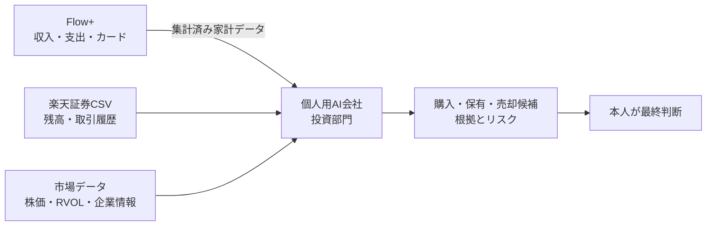

# Flow+ × 個人用AI会社 投資部門 連携設計書

更新日: 2026-07-19

## 結論

投資AIの本体は、家計簿アプリFlow+ではなく**個人用AI会社の投資部門**に実装する。

- Flow+: 家計データを収集・整理するシステム
- 個人用AI会社: 投資分析・候補提示・判断記録を行うシステム
- 楽天証券CSV: 保有資産・取引履歴の情報源
- 市場データ: 株価、出来高、RVOL、企業情報等の情報源

Flow+と個人用AI会社は別プロジェクトのまま維持し、認証された読み取り専用APIで連携する。



## システムごとの責任範囲

### Flow+

担当すること:

- Gmail等からカード利用通知を取得する
- 収入・支出を記録・分類する
- 未引落しのカード利用額を集計する
- 固定費・予定支出・入金予定を管理する
- 現在の利用可能残高を算出する
- 投資AIへ必要最小限の集計データを渡す

担当しないこと:

- 個別株の選定
- RVOL、株価、決算等の分析
- 購入・売却判断
- 証券注文の実行

### 個人用AI会社の投資部門

担当すること:

- Flow+から当月の家計集計を取得する
- 楽天証券CSVを解析する
- 投信50%・個別株50%との差を計算する
- 短期・中期・長期ごとに銘柄を分析する
- 出来高、RVOL、流動性、企業情報を分析する
- 銘柄別・半導体テーマ別の集中度を確認する
- 購入可能額と購入候補を提示する
- 保有継続・段階売却・撤退候補を提示する
- 判断理由と実績を保存する

担当しないこと:

- 証券会社への自動注文
- 本人確認なしの購入・売却
- Flow+の家計データの書換え
- Gmail本文の重複取得

## Flow+から渡すデータ

投資AIへGmail本文や全取引明細を渡さず、原則として次の集計値だけを渡す。

| 項目 | 内容 |
|---|---|
| target_month | 判定対象月 |
| available_cash | 現在利用できる個人資金 |
| confirmed_income | 確定収入 |
| expected_income | 入金予定 |
| confirmed_expenses | 確定支出 |
| pending_card_amount | 未引落しカード利用額 |
| fixed_expenses | 固定費 |
| scheduled_expenses | 一時的な予定支出 |
| already_invested | 当月すでに投資した金額 |
| personal_cash_floor | 個人生活用として残す金額。自動推定または設定値 |
| investable_amount | 当月の投資可能額 |
| calculated_at | 計算日時 |
| data_freshness | データの最新性 |
| confidence | 判定信頼度 |
| missing_data | 不足データ |

投資可能額の基本式:

```text
投資可能額
= 現在利用できる個人資金
+ 次回判定日までの入金予定
- 未引落しカード利用額
- 固定費・予定支出
- 個人生活用として残す金額
- 当月すでに投資した金額
```

## API要件

想定エンドポイント:

```text
GET /api/integrations/investment-capacity?month=YYYY-MM
```

認証:

- 公開APIにしない
- サーバー間認証を使用する
- 認証情報をブラウザ側へ埋め込まない
- Vercelの環境変数等で秘密情報を管理する
- 認証方式はFlow+の既存実装を調査してから決定する

レスポンス例:

```json
{
  "target_month": "2026-07",
  "available_cash": 120000,
  "confirmed_income": 180000,
  "expected_income": 0,
  "confirmed_expenses": 95000,
  "pending_card_amount": 42000,
  "fixed_expenses": 60000,
  "scheduled_expenses": 10000,
  "already_invested": 15000,
  "personal_cash_floor": 50000,
  "investable_amount": 28000,
  "calculated_at": "2026-07-19T12:00:00+09:00",
  "data_freshness": "current",
  "confidence": "high",
  "missing_data": []
}
```

数値はレスポンス形式の例であり、前川さんの実データではない。

## 投資部門の判定順序

1. Flow+のデータが最新か確認する。
2. 当月の投資可能額を取得する。
3. 0円以下なら、新規投資を見送る案を表示する。
4. 投信・個別株の現在比率を計算する。
5. 50:50との差を計算する。
6. 個別株側が不足していても、銘柄別上限・半導体集中度を確認する。
7. 短期・中期・長期スコアとRVOL等を確認する。
8. 購入候補、購入上限額、見送り理由を提示する。
9. 本人が最終判断する。
10. 判断理由と後日の結果を保存する。

## 現在の配分と目標

- 現在: 投資信託68.50%、個別株31.39%
- 目標: 投資信託50%、個別株50%
- 現在の保有商品2,054,100円を基準にした個別株側の不足額: 381,536円

不足額を一括購入する指示ではない。Flow+で毎月算出された投資可能額の範囲内で、段階的に近づける。

## 実装フェーズ

### Phase 1: 個人用AI会社側を先行

- 楽天証券CSV取込
- 現在ポートフォリオ分析
- 50:50との差分表示
- 銘柄分析、RVOL、集中度
- Flow+連携前は投資可能額を手動入力または未確定表示

### Phase 2: Flow+側の読取API

- 既存の認証・DB・収支計算を調査
- 投資可能額の集計処理を追加
- 認証付き読取専用APIを追加
- データ最新性・不足項目を返す

### Phase 3: 自動連携

- 個人用AI会社からFlow+ APIを取得
- 定期更新
- 投資候補画面へ反映
- データ不完全時の警告
- 判断ログと実績振り返り

## Codex／Claudeへ渡す資料

### Flow+プロジェクトへ渡すもの

1. Flow+プロジェクト本体
2. 本連携設計書

Flow+側では、家計集計と読取専用APIだけを実装する。

### 個人用AI会社プロジェクトへ渡すもの

1. 個人用AI会社プロジェクト本体
2. `portfolio_analysis_20260719.md`
3. `investment_learning_note_source.md`
4. 本連携設計書

個人用AI会社側へ、投資分析・判断支援の本体を実装する。

## セキュリティ要件

- 家計データAPIを認証なしで公開しない
- Gmail本文、カード番号、認証トークンを投資AIへ渡さない
- APIは必要最小限の集計値だけを返す
- ログへ秘密情報や詳細な家計明細を残さない
- AIは証券注文を自動実行しない
- 最終購入・売却は本人の承認を必要とする

## 実装前に確認すること

- Flow+のリポジトリと技術構成
- データベースのテーブル構造
- Google認証方式
- 収支・カード利用・予定支出の保存方法
- 既存の投資ページの役割
- 個人用AI会社の投資部門を置くディレクトリ
- 両プロジェクトのVercel環境と環境変数管理

